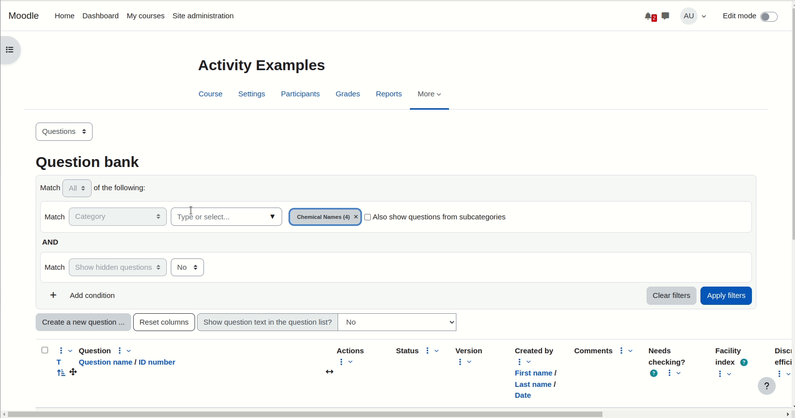

# moodle-qbank_bulktags

This is a Moodle Question bank plugin to allow bulk updating of question tags.
It was mainly created at MoodleDACH24 in Vienna. With thanks to Stephan Robotta
https://github.com/srobotta for collaboration and inspiration.

To install it from the root of a moodle installation

git clone git@github.com:marcusgreen/moodle-question_bank_bulktags.git question/bank/bulktags

For Moodle development and consultancy, contact Moodle partner Catalyst EU

https://www.catalyst-eu.net/contact-us/brighton

The latest source can be found at

https://github.com/marcusgreen/moodle-qbank_bulktags

